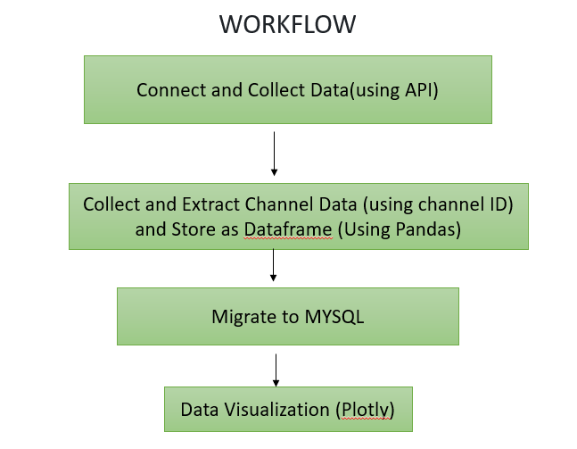

 YOUTUBE DATA HARVESTING AND WAREHOUSING.

PROJECT TITLE:
           YouTube Data Harvesting and Warehousing using SQL and Streamlit.
           
PROJECT DESCRIPTION:
          Youtube-Data-Harvesting-And-Warehousing YouTube Data Harvesting and Warehousing is a project that intends to provide users with the ability to access and analyse data from numerous YouTube channels. SQL, MongoDB, and Streamlit are used in the project to develop a user-friendly application that allows users to retrieve, save, and query YouTube channel and video data.
          This project aims to develop a user-friendly Streamlit application that utilizes the Google API to extract information on a YouTube channel, stores it in a SQL database, and enables users to search for channel details and join tables to view data in the Streamlit app.

WORKFLOW:

1. CONNECT TO YOUTUBE API : Retrieval of youtube channel information like Channel, Playlist, Videos, Comments for videos, etc by giving channel Id as input using the YouTube API.

2. COLLECT AND EXTRACT DATA : 
    ---> The API and the Channel ID (Extracted from the Channel Page) is used to retrieve channel details, 
    videos details and comment details.
    ---> Clean the extracted data and then Convert it to dataframe using Pandas.

3. MIGARTE TO MYSQL : Migration of data to a MYSSQL database for storing all the information about channels and also efficient querying and analysis.

4. DATA VISUALIZATION : Search and retrieval of data from the MYSQL database to get business insights and data visualization.

TOOLS AND LIBRARIES USED:
 1. PYTHON -> Python is a powerful programming language renowned for being easy to learn and understand. Python is the primary language employed in this project for the development of the complete application, including data retrieval, processing, analysis, and visualisation.
 2. GOOGLE API CLIENT -> Its primary purpose in this project is to interact with YouTube's Data API v3, allowing the retrieval of essential information like channel details, video specifics, and comments. By utilizing googleapiclient, developers can easily access and manipulate YouTube's extensive data resources through code.
 3. MYSQL SERVER 8.0 -> MYSQL is an open-source relational database management system.organizes data into one or more data tables in which data may be related to each other; these relations help structure the data. SQL is a language that programmers use to create, modify and extract data from the relational database
 4. STREAMLIT -> Streamlit library is a framework used to build a user-friendly UI web application that enables users to interact with the programme and carry out data retrieval and analysis operations.
 5. PANDAS -> Python library used for working with data sets. It has functions for analyzing, cleaning, exploring, and manipulating data. It is used widely for Data collection and manipulation for analytics.
 6. plotly -> open-source library that can be used for data visualization and understanding data simply and easily. Plotly supports various types of plots like line charts, scatter plots, histograms, box plots, etc.

Libraries to import :: googleapiclient.discovery , streamlit , pandas, pymysql, plotly

CONCLUSION:
        This project aim is to develop a user-friendly Streamlit application that utilizes the Google API to extract information on a YouTube channel, stores it in a MYSQL database, and enables users to search for channel information and finally done data visualization to identify trends, get business insights and make predictions for future, and improve decision-making.
